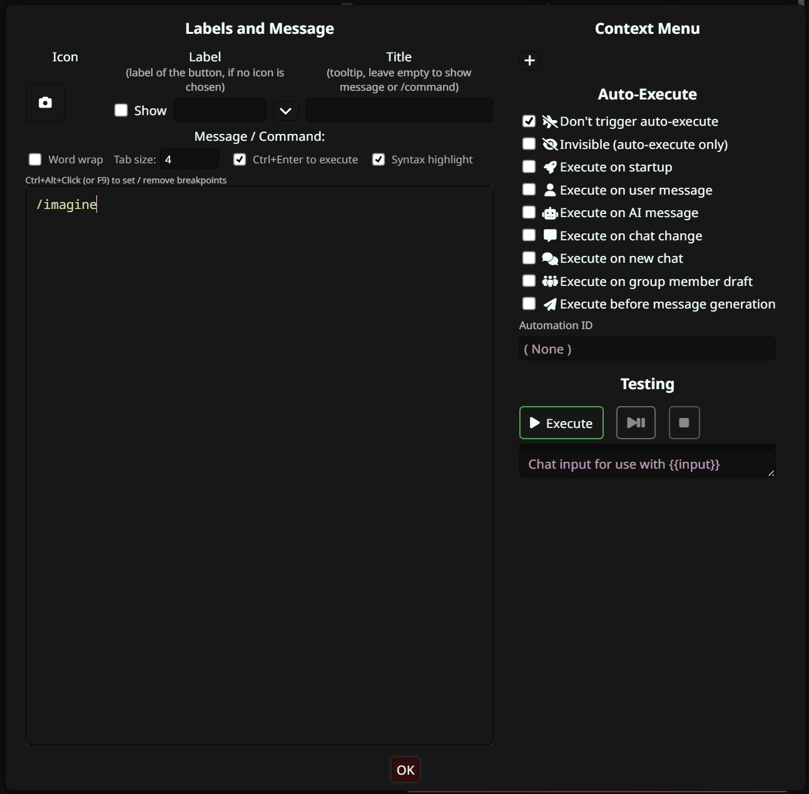

# ComfyUI-Imagine

A SillyTavern extension that generates images on demand by reading the current chat context, sending it to an LLM to write an image prompt, and sending it to a ComfyUI instance.

## Requirements

- SillyTavern `release` v1.18.0+
- A running ComfyUI instance
- An OpenAI-compatible LLM API endpoint (e.g. OpenAI, a local Ollama server, or any OpenAI-compatible API)

## Installation

In SillyTavern, open **Extensions** → **Install Extension**, paste the repo URL below, and click **Install**:

```
https://github.com/mozophe/ST-ComfyUI-Imagine
```

## Setup

1. **Start ComfyUI** — pick the command for your setup:

   **Same machine** (ComfyUI and SillyTavern on one computer):
   ```
   python main.py --enable-cors-header
   ```

   **Different machines** (e.g. SillyTavern on a Raspberry Pi, ComfyUI on a desktop):
   ```
   python main.py --listen 0.0.0.0 --enable-cors-header
   ```

   - `--enable-cors-header` — needed in **both** cases. SillyTavern and ComfyUI run on different ports, so the browser treats them as different origins and blocks `fetch` without this header — even on the same machine, even when the port is reachable via `curl`.
   - `--listen 0.0.0.0` — **only** for the different-machines case; it makes ComfyUI accept connections from other computers on the network. Omit it for a same-machine setup.
   - Add `--port <number>` to either command if you don't want the default port `8188`.

   > **Easiest way to get ComfyUI running (Windows): the portable build.** Download `ComfyUI_windows_portable` from the [ComfyUI releases page](https://github.com/comfyanonymous/ComfyUI/releases), extract it, and put your models under `ComfyUI\models\`. It bundles its own Python and dependencies — nothing to install.
   >
   > You don't run `python main.py` yourself with the portable build — you edit its launcher. Open **`run_nvidia_gpu.bat`** (or `run_cpu.bat`) in Notepad and append the flags to the command line that's already there:
   >
   > ```bat
   > .\python_embeded\python.exe -s ComfyUI\main.py --windows-standalone-build --listen 0.0.0.0 --enable-cors-header
   > pause
   > ```
   >
   > Save, then double-click the `.bat` to start ComfyUI. Keep the existing `--windows-standalone-build` flag; just add the others. Drop `--listen 0.0.0.0` for a same-machine setup, and add `--port <number>` here too if you don't want `8188`.
2. **ComfyUI Base URL** — point it at ComfyUI, then click **Test ComfyUI Connection** to verify:
   - **Same machine** — `http://localhost:8188`
   - **Different machine** — the ComfyUI computer's LAN IP and port, e.g. `http://192.168.1.50:8188`
3. **LLM** — enter your API base URL, API key, and model name. Click **Test API Connection** to verify. The base URL must be an **OpenAI-compatible** endpoint (the extension calls `/chat/completions` and `/models`), so give the `v1` base — e.g. `https://api.openai.com/v1`, `http://localhost:11434/v1` for Ollama, or any other provider exposing that API. Don't include the `/chat/completions` path; the extension appends it. This is a separate LLM from your main chat model: writing an image prompt is a simple task, so a smaller, cheaper model (e.g. Gemma 4 31B — `gemma-4-31B-it`) is usually good enough and keeps cost/latency down. Point it at a larger model if you prefer.
   > ⚠️ **Create a separate API key just for this extension and give it a low spending limit. Don't paste your main key — if this one leaks, only a small amount of spending is at risk, not your whole account.**
   >
   > Why: the API key is stored **in plain text** in SillyTavern's `settings.json` and sent from the browser. This is unavoidable — SillyTavern extensions run entirely in the browser with no backend, so there's no server to proxy the request or keep the key secret; the browser calls the LLM API directly and `settings.json` is the only place to persist it. Using a dedicated key here also avoids the alternative of enabling SillyTavern's `allowKeysExposure = true` — a global flag that hands **every** key ST stores (OpenAI, Claude, etc.) to the browser, where any other extension, injected card script, or XSS could read your whole key vault at once. A single scoped, low-cap key caps the damage instead.
4. **System Prompt** — the extension ships with a default system prompt (tuned for Krea 2 Turbo) that tells the LLM how to write the image prompt. The default frames every image as a **first-person POV** photo from your persona's eyes and tells the LLM to describe **only what's visible in frame**. It's always available as the **`Krea 2 Turbo (default)`** entry in the **System Prompt Presets** dropdown — this entry is kept in sync with the shipped default (it resets on reload), so to customise, edit the textarea and use **Save As** to store your own named preset rather than overwriting the default. Switch between saved prompts via the presets dropdown, overwrite the selected (non-default) preset with **Save**, and remove one with the 🗑 button. Presets are stored in your SillyTavern settings.
5. **Upload a Workflow** — export your ComfyUI workflow in **API format** (enable Dev Mode in ComfyUI, then **Graph** menu → **Export (API)**), then upload it here. Workflows are stored in your SillyTavern settings — no files are written to the server. Two example workflows are provided in the repo's [`workflows/`](workflows/) folder, both wired for the required `IMAGINE_PROMPT` / `IMAGINE_LORA` / `IMAGINE_LORA_TRIGGER` node titles — pick whichever matches your setup. They're **templates**, not drop-in defaults: the model, VAE, CLIP, and LoRA paths are machine-specific, so adapt them before uploading. See [Using the Example Workflows](#using-the-example-workflows) for step-by-step instructions.
6. **Select Active Workflow** — choose the workflow to use. Use the 🗑 button to delete workflows you no longer need.
7. **Character LoRAs** *(optional)* — attach a LoRA to the active character so it loads automatically whenever that character is active. See [Per-Character LoRAs](#per-character-loras) below.
8. **Generation Settings** — image count (1–8), chat history limit (how many of the latest chat messages are sent to the prompt LLM; `0` = entire chat, default `20`), sender name for injected messages.

## Usage

Type `/imagine` in the chat input or attach it to a Quick Reply button. The extension will:

1. Gather the current character card, user persona, and chat history
2. Ask the configured LLM to write a prompt for Comfy UI
3. Post the prompt to ComfyUI and wait for the result
4. Inject the generated image into chat as a message from "Camera" (hidden from the main model)

Use ST's built-in **Abort** button to cancel generation mid-flight.

### Quick Reply Setup

To add a one-click image button to the chat bar:

1. Open the **Quick Reply** extension settings and create (or edit) a Quick Reply set, then add a new reply.
2. In the reply editor, set the **Message / Command** box to:
   ```
   /imagine
   ```
3. Give it a **Label** (e.g. `📷`) or pick an icon so it shows on the chat bar.
4. Leave the **Auto-Execute** options at their defaults — `Don't trigger auto-execute` should stay checked so it only fires when you click it.
5. Click **OK**, then enable the Quick Reply set so the button appears.

Clicking the button now runs `/imagine` exactly as typing it would.



Each generated image message has a ⓘ button in the message action row. Click it to open a debug modal showing the system prompt, the full LLM context (character + persona + chat log), and the generated image prompt.

## Security Note

The LLM API key is stored **in plain text** in SillyTavern's `data/<user>/settings.json` and sent directly from the browser — unavoidable for a browser-only extension with no backend. It can leak two ways:

1. **The file** — anyone who gets your `settings.json` (or a backup, screen-share, or a copy you post when asking for help) can read the key directly.
2. **The browser** — because the key lives in the page, any other installed extension, a malicious script injected by a character card, or an XSS bug in ST can read it at runtime. (Enabling ST's `allowKeysExposure = true` makes this worse — it exposes **every** key ST stores, not just this one.)

Mitigation: use a **dedicated, low-spending-limit API key** for this extension (see the warning in [Setup](#setup) step 3) so a leak caps the damage, and don't share or post your `settings.json`.

## Workflow Notes

- Workflows must be in **ComfyUI API export format** (not the standard UI format).
- The extension injects the LLM-generated prompt into the first `CLIPTextEncode` node (positive conditioning) and the negative prompt (if set) into the second — **unless** nodes titled `IMAGINE_PROMPT` / `IMAGINE_NEGATIVE` are present, which take precedence (see [Custom Prompt Target Nodes](#custom-prompt-target-nodes)).
- If image count > 1, the KSampler seed is randomised for each job.

### Using the Example Workflows

The repo ships **two** ready-made templates, both wired for the **ComfyUI-Imagine** node titles (`IMAGINE_PROMPT`, `IMAGINE_LORA`, `IMAGINE_LORA_TRIGGER`) plus the empty-delimiter trigger convention, and both targeting a **Krea2 Turbo** setup (separate diffusion model + CLIP + VAE, 8 steps, cfg 1, euler/simple):

| File | LoRA chain | Use when |
|---|---|---|
| [`Krea2_CLora.json`](workflows/Krea2_CLora.json) | one loader (`IMAGINE_LORA`) for the per-character LoRA | you only want per-character LoRAs |
| [`Krea2_StyleLora_CLora.json`](workflows/Krea2_StyleLora_CLora.json) | an always-on `Load LoRA` **feeding** the per-character `IMAGINE_LORA` | you also want a style/quality LoRA on **every** image — see [Adding an Always-On (Second) LoRA](#adding-an-always-on-second-lora) |

Pick one as your starting point — but you must point the loaders at **your own** model files first. Both ship with placeholder filenames, so they won't run until you set the real ones. The steps below use `Krea2_CLora.json`; `Krea2_StyleLora_CLora.json` is identical apart from the extra always-on loader.

1. **Download** your chosen file from the repo.
2. **Drag and drop** the file onto the ComfyUI canvas to load the graph.
3. Set the **right files** in each loader's dropdown:
   - **Load Diffusion Model** (`UNETLoader`) → your Krea2/diffusion model
   - **Load CLIP** (`CLIPLoader`) → your text-encoder/CLIP
   - **Load VAE** (`VAELoader`) → your VAE
   - **IMAGINE_LORA** (`LoraLoaderModelOnly`) → any **real** LoRA file (see note below)
4. *(Optional)* Add an **always-on LoRA** (a style/quality/detail LoRA applied to every image, separate from the per-character one) — see [Adding an Always-On (Second) LoRA](#adding-an-always-on-second-lora).
5. **Export as API format** (enable Dev Mode in ComfyUI → Settings → Enable Dev Mode Options, then **Graph** menu → **Export (API)**).
6. **Upload** the exported file via Settings → Workflows → **Upload Workflow**, then select it as the active workflow.

> **The `IMAGINE_LORA` node must point at a real, existing LoRA file**, even though per-character settings override it. `LoraLoaderModelOnly` still loads the file when no character LoRA is set (it's just applied at strength 0), so a non-existent filename makes ComfyUI error. Point it at any valid LoRA as the fallback.

**Using a different base model (not Krea2)?** Don't adapt this file. It's tuned end-to-end for Krea2 Turbo — not just the model, but the sampler, scheduler, CFG, steps, and resolution — so porting it to another model means fixing every one of those, node by node. Instead, **start from a known-good workflow for _your_ model** (the one you already use in ComfyUI, or a reference workflow for that model, which already has the right sampler settings), then just apply the `IMAGINE_*` node titles (see below), export in API format, and upload. The extension only cares about the node titles, not the graph — any workflow works once the titles are set.

### Custom Prompt Target Nodes

If you want to prepend a fixed keyword or prefix inside the workflow itself (e.g. using a string concat node), you can redirect injection away from `CLIPTextEncode` using node titles:

1. In ComfyUI, set the title of your **prompt-receiver** string node to `IMAGINE_PROMPT`.
2. Optionally, title your negative-prompt string node `IMAGINE_NEGATIVE`.
3. Export the workflow in API format and upload it.

The extension will inject into those titled nodes instead of the first/second `CLIPTextEncode`. Fallback to `CLIPTextEncode` order applies when no titled nodes are found (existing workflows are unaffected).

Both `inputs.text` (most custom string nodes) and `widgets_values[0]` (ComfyUI's built-in `PrimitiveNode`) are supported.

### Per-Character LoRAs

Bind a different LoRA to each SillyTavern character so the right one loads automatically — no settings change when you switch characters. The workflow stays the same; only the LoRA filename (and strength) swaps based on who is active.

**One-time workflow setup:** in ComfyUI, add a **Load LoRA** node (display name for `LoraLoaderModelOnly`; or **Load LoRA (Model and CLIP)** = `LoraLoader` if your model's LoRA also needs CLIP — both are accepted) and set its **title** to `IMAGINE_LORA`, then export and upload the workflow. The extension acts **only** on that titled node (and the `IMAGINE_LORA_TRIGGER` node) — any other LoRA loaders in your workflow are left untouched. If a character has a LoRA set but no `IMAGINE_LORA` node exists, `/imagine` shows an error telling you to title it.

**Per character:** with a character active, open the extension's **Character LoRAs** section. It shows the active character's name, a LoRA dropdown pulled live from ComfyUI (handles thousands of LoRAs — on **desktop** it's searchable, just start typing to filter; on **mobile** it falls back to your device's native picker, matching how SillyTavern's own model dropdowns behave on touch), a strength field, and an optional **trigger word(s)** field. Pick a LoRA, strength, and trigger — it's saved against that character and applied on every `/imagine` for them. Use the 🔁 button to refresh the LoRA list after installing new LoRAs in ComfyUI.

**Trigger words (optional):** many LoRAs need a trigger phrase in the prompt. Enter it in the trigger field, and in ComfyUI add a string node titled `IMAGINE_LORA_TRIGGER` and feed it into your prompt (e.g. via a `StringConcatenate` node ahead of `CLIPTextEncode`). The active character's trigger is written into that node on each generation. **Set the concat delimiter to empty (`""`) and end each trigger with its own separator** (e.g. `aliceface woman, `) — that way a character with no trigger produces a clean prompt with nothing prepended. Leave the field blank for LoRAs that need no trigger.

- The binding is keyed by the character card's avatar filename, so it survives renames.
- Switch to a character with **no LoRA set** (or no character active, e.g. a group chat) → the LoRA is neutralised: its strength is forced to `0` (image identical to no-LoRA) and the trigger node is cleared. The workflow's baked-in default LoRA does **not** leak in. (API-format workflows can't express a true node bypass, so strength 0 is used instead — the loader still runs but has zero effect.)
- The list is fetched from ComfyUI (`/object_info/LoraLoader`); ComfyUI must be reachable to populate the dropdown.
- Stored in your SillyTavern settings (not on the character card), so the binding does not travel if you export/share the card.

### Adding an Always-On (Second) LoRA

Want a LoRA that's applied to **every** image regardless of character — a style, quality, detail, or aesthetic LoRA — alongside the per-character one? Add a second LoRA loader to the workflow. The extension only ever touches the node titled `IMAGINE_LORA`, so **any other loader you add is left exactly as you set it** and stays on for every generation.

LoRA loaders chain through the `model` connection. In the example workflow the chain is `UNETLoader → IMAGINE_LORA → KSampler`; you insert your extra loader into that chain:

1. In ComfyUI, **double-click an empty spot on the canvas** to open node search and type `Load LoRA`, then pick **Load LoRA** (the model-only loader — `class_type` `LoraLoaderModelOnly`). This Krea2 setup loads CLIP separately, so model-only is correct; pick **Load LoRA (Model and CLIP)** (`LoraLoader`) only if your model's LoRA also needs the CLIP. Tip: you can also drag a link off the `IMAGINE_LORA` **MODEL** output onto empty canvas and release — ComfyUI then lists only nodes that accept a MODEL input.
2. **Rewire** so the new node sits in the model chain. Either order works — e.g. put it after `IMAGINE_LORA`:
   - connect `IMAGINE_LORA`'s **MODEL** output → the new node's **model** input
   - connect the new node's **MODEL** output → **KSampler**'s **model** input
3. On the new node, pick its **lora_name** and **strength_model**.
4. **Do not** title it `IMAGINE_LORA` (or `IMAGINE_LORA_TRIGGER`) — leave its default title or name it something like `Style LoRA`. That keeps the extension from touching it.
5. Export as API format and upload as usual.

Repeat to stack more always-on LoRAs — just keep chaining `MODEL` out → next loader's `model` in, ending at the `KSampler`. If such a LoRA needs a trigger word in the prompt, bake it into the **Prompt Prefix/Suffix** fields (Setup step 3) since the per-character trigger field is reserved for `IMAGINE_LORA_TRIGGER`.

A worked example with two LoRAs is in [`workflows/Krea2_StyleLora_CLora.json`](workflows/Krea2_StyleLora_CLora.json): an always-on style loader (`Load LoRA`) feeds the per-character loader (`IMAGINE_LORA`), chained `UNETLoader → Load LoRA → IMAGINE_LORA → KSampler`. Note only `IMAGINE_LORA` is touched by the extension; `Load LoRA` stays on for every image. (Same placeholder-path caveat as the single-LoRA template — adapt the model/LoRA files to your setup.)

## License

[MIT](LICENSE) © mozophe
