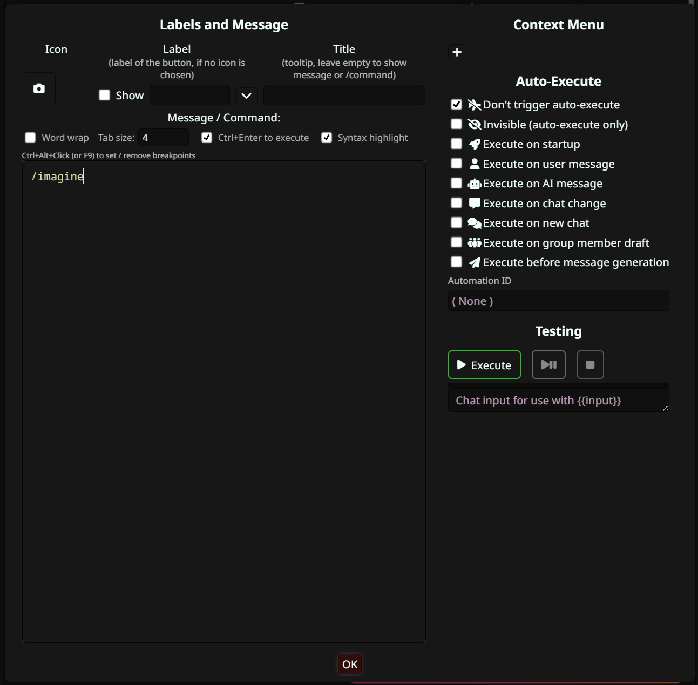
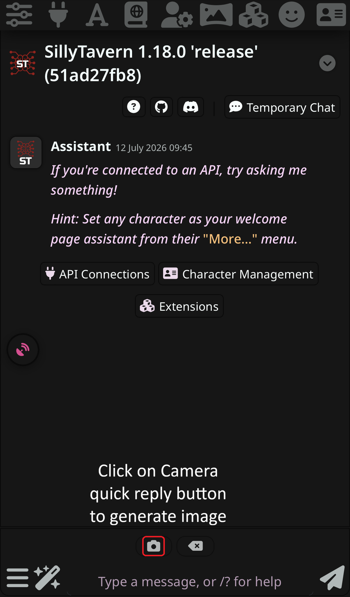

<div align="center">

# 📷 ComfyUI-Imagine

**Illustrate your chat, one click at a time.**

A [SillyTavern](https://github.com/SillyTavern/SillyTavern) extension that reads the scene you are in, writes an image prompt for it, renders it in [ComfyUI](https://github.com/comfyanonymous/ComfyUI), and drops the picture into the conversation.


<!-- TODO: hero demo goes here. Capture a short GIF (or screenshot) of clicking the 📷
     button on a message and the generated image appearing in chat, save it as
     docs/images/demo.gif, then uncomment the line below.


-->

</div>

---

## What it does

- **Click 📷 on any message** and get an image of that moment in the story. Not just the latest message: pick any point in the chat, and the picture is inserted right there.
- **Writes the prompt for you.** A small LLM reads the character card, your persona, and the recent chat, and turns them into an image prompt. You never write one by hand.
- **Uses your ComfyUI, your models, your workflow.** Bring any API-format workflow. The extension finds nodes by title, so it does not care what your graph looks like.
- **Remembers a LoRA per character.** Bind a LoRA to a character once and it loads automatically whenever they are active. No settings to change when you switch.

Images are hidden from your main chat model, so illustrating a scene never changes how the character responds.

## Requirements

| You need | Details |
|---|---|
| **SillyTavern** | `release` v1.18.0 or newer, on desktop or mobile |
| **ComfyUI** | a running instance, on the same computer or anywhere on your LAN |
| **An LLM API** | any OpenAI-compatible endpoint: OpenRouter, OpenAI, a local KoboldCpp server, anything exposing `/chat/completions` |
| **A ComfyUI workflow** | your own, or one of the two [example templates](workflows/) in this repo |

Optional but recommended: the [`ComfyUI-Image-Saver`](https://github.com/alexopus/ComfyUI-Image-Saver) custom node. Step 2 below covers it.

---

## Quick Start

Eight steps. Steps 1 and 2 happen in **ComfyUI**, the rest in **SillyTavern**.

### 1. Start ComfyUI with the right flags

**Same computer** as SillyTavern:

```bash
python main.py --enable-cors-header
```

**Different computers** (for example SillyTavern on a phone or Raspberry Pi, ComfyUI on a desktop):

```bash
python main.py --listen 0.0.0.0 --enable-cors-header
```

`--enable-cors-header` is required in **both** cases, including same-computer setups. Without it your browser refuses to talk to ComfyUI even though the port is reachable. Add `--port <number>` to either command if you do not want the default `8188`.

<details>
<summary><b>On Windows? Use the portable build (easiest setup)</b></summary>

<br>

Download `ComfyUI_windows_portable` from the [ComfyUI releases page](https://github.com/comfyanonymous/ComfyUI/releases), extract it, and put your models under `ComfyUI\models\`. It bundles its own Python, so nothing needs installing.

Edit its launcher instead of running `python main.py` yourself. Open **`run_nvidia_gpu.bat`** (or `run_cpu.bat`) in Notepad and add the flags to the line that is already there:

```bat
.\python_embeded\python.exe -s ComfyUI\main.py --windows-standalone-build --listen 0.0.0.0 --enable-cors-header
pause
```

Save, then double-click the `.bat` to start ComfyUI. Keep the existing `--windows-standalone-build` flag and just add the others. Drop `--listen 0.0.0.0` if ComfyUI and SillyTavern are on the same computer.

</details>

### 2. Install the Image Saver node

In ComfyUI, open **Manager → Custom Nodes Manager**, search for **`ComfyUI-Image-Saver`** (by *alexopus*), click **Install**, then restart ComfyUI.

The example workflows use it to save **WebP** instead of PNG, which is roughly **93% smaller** for the same picture with no visible loss. Since every generated image is stored inside SillyTavern, that adds up fast. Skip this step only if you are bringing your own workflow that uses the built-in `SaveImage` node. See [Why WebP](#why-webp) for the full reasoning.

### 3. Install the extension

In SillyTavern, open **Extensions → Install Extension**, paste this URL, and click **Install**:

```
https://github.com/mozophe/ST-ComfyUI-Imagine
```

Open the **ComfyUI-Imagine** panel in the extensions drawer. Everything below happens there.

### 4. Connect to ComfyUI

Enter the base URL, then click **Test ComfyUI Connection**.

- **Same computer:** `http://localhost:8188`
- **Different computer:** the ComfyUI machine's LAN IP and port, for example `http://192.168.1.50:8188`

Do not continue until this test passes. If it fails, see [Troubleshooting](#troubleshooting).

### 5. Connect your prompt LLM

Enter the **API base URL**, **API key**, and **model name**, then click **Test API Connection**.

The base URL must be the **`v1` base** of an OpenAI-compatible API. Do **not** include `/chat/completions`; the extension adds that itself.

**Hosted**

| Provider | Base URL | Model name looks like |
|---|---|---|
| [OpenRouter](https://openrouter.ai) | `https://openrouter.ai/api/v1` | `vendor/model`, for example `google/gemma-4-31b-it` |
| OpenAI | `https://api.openai.com/v1` | `gpt-4o-mini` |

**Local**

| Server | Base URL | Model name looks like |
|---|---|---|
| [KoboldCpp](https://github.com/LostRuins/koboldcpp) | `http://localhost:5001/v1` | the GGUF you loaded |
| [LM Studio](https://lmstudio.ai) | `http://localhost:1234/v1` | the identifier shown in its server panel |
| [llama.cpp](https://github.com/ggml-org/llama.cpp) (`llama-server`) | `http://localhost:8080/v1` | the GGUF you loaded |

Local servers usually need no API key; leave the field empty unless you started yours with one. If SillyTavern runs on a different machine from the LLM server, use that machine's LAN IP instead of `localhost` and start the server listening on all interfaces.

Any other OpenAI-compatible provider or server works the same way.

**OpenRouter is the easiest starting point.** One key reaches hundreds of models from every vendor, you switch model by editing a single text field, and its catalogue includes free and near-free options that are more than good enough for this job. Copy the exact slug from the model's page on [openrouter.ai/models](https://openrouter.ai/models); the `vendor/` half is part of the name and is required.

**Going local costs you VRAM that ComfyUI wants.** The prompt model and the diffusion model compete for the same card, which can slow generation or fail to load outright. If you go local anyway, keep the prompt model small and limit how many layers you offload. Hosted keeps the GPU entirely for ComfyUI, which is the main argument for it here.

Either way, this setting is **independent of the model SillyTavern uses for chat**. Nothing stops you pointing it at the same one, but it is usually a waste: writing an image prompt is a far easier job than roleplay, so a large model costs more per image without producing a better picture.

A small cheap model is normally plenty. **Gemma 4 31B** (`google/gemma-4-31b-it` on OpenRouter) is a good default. Go larger only if the prompts you get are not detailed enough.

> [!TIP]
> **Make a dedicated API key for this extension and give it a low spending limit.** A browser-only extension has no backend, so the key is stored as plain text in your settings file. A scoped, low-cap key means an exposed key costs you nothing. See [Security](#security).

### 6. Prepare and upload a workflow

The extension needs a ComfyUI workflow exported in **API format**. If you already have a workflow you like, jump to [Adapting your own workflow](#adapting-your-own-workflow). Otherwise start from a template:

| Template | Use when |
|---|---|
| [`Krea2_CLora.json`](workflows/Krea2_CLora.json) | you want per-character LoRAs only |
| [`Krea2_StyleLora_CLora.json`](workflows/Krea2_StyleLora_CLora.json) | you also want a second LoRA applied to **every** image |

Both are tuned end to end for **Krea 2 Turbo** (separate diffusion model, CLIP and VAE; 8 steps; cfg 1; euler/simple) and both ship with **placeholder file paths**, so they will not run until you point them at your own models.

1. **Download** your chosen `.json` from the [`workflows/`](workflows/) folder.
2. **Drag and drop** it onto the ComfyUI canvas to load the graph.
3. **Point each loader at your own files:**
   - **Load Diffusion Model** (`UNETLoader`) → your Krea 2 or other diffusion model
   - **Load CLIP** (`CLIPLoader`) → your text encoder
   - **Load VAE** (`VAELoader`) → your VAE
   - **IMAGINE_LORA** (`LoraLoaderModelOnly`) → any **real, existing** LoRA file
4. **Export it:** enable Dev Mode (**Settings → Enable Dev Mode Options**), then **Graph → Export (API)**.
5. Back in SillyTavern: **Workflows → Upload Workflow**, pick the exported file, then select it as the **active workflow**.

> [!IMPORTANT]
> **`IMAGINE_LORA` must point at a real LoRA file** even though per-character settings override it. When no character LoRA is set the node still loads that file (at strength 0, so it has no effect), and a filename that does not exist makes ComfyUI throw an error. Any valid LoRA works as the fallback.

> [!NOTE]
> Not using Krea 2? **Do not adapt these templates.** Start from a workflow that already works for your model and add the `IMAGINE_*` titles to it instead. See [Adapting your own workflow](#adapting-your-own-workflow).

### 7. Add the 📷 button to your chat bar

This is how you will actually use the extension: one click, an image of the current scene. Set it up now, before your first test, so you never have to type a command.

SillyTavern's **Quick Reply** extension provides the button.

1. Open the **Quick Reply** extension settings, create or edit a Quick Reply set, then add a new reply.
2. Set the **Message / Command** box to `/imagine`.
3. Give it a **Label** (for example `📷`) or pick an icon so it shows on the chat bar.
4. Leave the **Auto-Execute** options alone. `Don't trigger auto-execute` should stay checked so it only fires when you click it.
5. Click **OK**, then enable the Quick Reply set.



The 📷 button now sits on your chat bar:



### 8. Generate your first image

Open a chat and **click the 📷 button**.

The extension gathers the scene, calls your LLM, waits on ComfyUI, and posts the finished picture into the chat as a message from **Camera**. Click the **ⓘ** button on that message to see exactly what prompt was written and how long each stage took.

If the image arrives, you are done. Nothing above needs revisiting. If it does not, see [Troubleshooting](#troubleshooting).

From here you have two ways to generate:

- **📷 on the chat bar** illustrates the current scene, the button you just made.
- **📷 in any message's three-dots menu** illustrates that moment instead, using only the story up to that point. Good for going back and adding a picture to an earlier scene. See [Generating images](#generating-images).

Everything else is optional polish:

- Bind a LoRA to each character: [Per-character LoRAs](#per-character-loras)
- Keep a LoRA on for every image: [Always-on LoRA](#adding-an-always-on-lora)
- Change how prompts are written, their POV, framing, style, and detail: [System prompt and presets](#system-prompt-and-presets)

---

## Troubleshooting

<details>
<summary><b>"Test ComfyUI Connection" fails, or images never arrive</b></summary>

<br>

Almost always a missing `--enable-cors-header` on ComfyUI. Your browser blocks the request before it leaves the page, so the extension sees a generic network failure.

It is needed **even when ComfyUI and SillyTavern run on the same computer**, because they use different ports and the browser treats different ports as different origins.

Telltale sign: `curl http://<host>:8188/system_stats` works from the command line, but the extension still fails. `curl` ignores CORS; browsers do not. Restart ComfyUI with the flag and test again. Check the browser console (F12) for a message mentioning CORS to confirm.

</details>

<details>
<summary><b>ComfyUI is on another computer and nothing connects at all</b></summary>

<br>

Two separate flags, both needed:

- `--listen 0.0.0.0` makes ComfyUI accept connections from other machines. Without it, it only answers on `localhost`.
- `--enable-cors-header` lets the browser use the connection.

Also check the URL you entered in the extension uses the ComfyUI machine's **LAN IP**, not `localhost`, and that a firewall is not blocking the port.

</details>

<details>
<summary><b>The example workflow loads with a red node and a "Missing Node Types" warning</b></summary>

<br>

The templates save with `Image Saver Simple`, from [`ComfyUI-Image-Saver`](https://github.com/alexopus/ComfyUI-Image-Saver). ComfyUI loads the graph fine without it, but the node shows as a red placeholder and the workflow will not run until you install it.

Easiest fix: **Manager → Install Missing Custom Nodes**, which picks it up straight from the loaded graph. Otherwise install it by hand (see [step 2](#2-install-the-image-saver-node)). Restart ComfyUI either way, then reload the workflow.

If you would rather not install it, delete the red node and wire the `IMAGE` output of the VAE Decode into a built-in **Save Image** node instead. You get PNG rather than WebP; see [Why WebP](#why-webp) for what that costs you.

</details>

<details>
<summary><b>"Workflow looks like a UI export, not API format"</b></summary>

<br>

You exported the **UI** format instead of the **API** format. They are different files: the API file has node IDs as top-level keys, the UI file has a `nodes` array.

Note this error appears when you **generate**, not when you upload. Upload only checks that the file is valid JSON, and a UI export is perfectly valid JSON, so it saves without complaint and fails on first use.

In ComfyUI: **Settings → Enable Dev Mode Options**, then use **Graph → Export (API)**, not plain **Export**. Upload that file instead.

</details>

<details>
<summary><b>The LoRA dropdown is empty</b></summary>

<br>

The list is fetched live from ComfyUI (`/object_info/LoraLoader`), so ComfyUI must be reachable when you open the panel. Fix the connection first ([step 4](#4-connect-to-comfyui)), then press the **🔁** button next to the dropdown to reload the list.

Same button after installing new LoRAs in ComfyUI: the list is cached until you refresh it.

</details>

<details>
<summary><b>"No IMAGINE_LORA node found" when generating</b></summary>

<br>

You have set a LoRA for this character but the active workflow has no node **titled** `IMAGINE_LORA`. The extension matches by node title, not node type.

In ComfyUI, right-click your Load LoRA node → **Title**, set it to exactly `IMAGINE_LORA`, re-export in API format, and upload again. See [Per-character LoRAs](#per-character-loras).

</details>

<details>
<summary><b>ComfyUI errors about a missing LoRA file</b></summary>

<br>

The `IMAGINE_LORA` node's `lora_name` points at a file that does not exist, usually the placeholder left in the template. Even with no character LoRA set, the node still loads whatever file it names. Point it at any real LoRA in your `models/loras` folder.

</details>

<details>
<summary><b>The image prompt contains the model's thinking out loud</b></summary>

<br>

Happens with reasoning models that write their thoughts in plain prose with no `<think>` tags and no separate `reasoning` field. The fallback rule treats the **last paragraph** as the prompt.

Fix it in your system prompt: instruct the model to put the final image prompt in its **own last paragraph**, separated by a blank line. The bundled default does this. See [Reasoning models](#reasoning-models).

</details>

<details>
<summary><b>Generation finishes but no image appears / the LLM returned nothing</b></summary>

<br>

Open the browser console (F12). When the LLM produces no usable prompt, the extension logs the full API response there: `finish_reason`, any reasoning text, the content field, and the raw body.

The usual causes are a token budget spent entirely on reasoning (`finish_reason: length`), or a model that refused. Raise **Max Tokens** in the LLM settings, or switch model.

</details>

---

# Reference

## Generating images

### The 📷 button on the chat bar

Illustrates the **current scene**. This is the Quick Reply button from [Quick Start step 7](#quick-start), and the way you will use the extension most of the time. On click, the extension:

1. Gathers the character card, your persona, and recent chat history.
2. Asks your configured LLM to write an image prompt.
3. Sends the prompt to ComfyUI and waits.
4. Posts the image into the chat as a message from **Camera**, hidden from your main model.

Use SillyTavern's **Abort** button to cancel mid-generation.

The button runs the `/imagine` slash command, which you can also type into the chat input if you ever want to. There is no reason to in normal use; the button does the same thing without the typing.

### The 📷 button on any message

Every chat message gets a 📷 icon in its three-dots menu (generated images themselves are skipped). Click it to illustrate that specific point in the story:

- The prompt is built from the chat **only up to that message**, so an image added to an earlier scene is not contaminated by what happened later.
- The picture is inserted **directly after** that message.
- The view scrolls to the new image when it is done, so you do not lose your place.
- A stop button appears while it works, in case you want to cancel.

### The ⓘ debug panel

Every generated image has an **ⓘ** button in its action row. It opens a panel showing:

- **Generation timing:** how long this image took, split into **LLM** (writing the prompt) and **ComfyUI** (rendering), plus the total. Alongside it, a **rolling average of your last 10 generations** for each stage. That average is global and lives in your SillyTavern settings, so it survives reloads and follows you across characters and chats. Images generated before this feature shipped show no timing.
- The **system prompt** used.
- The full **LLM context**: character, persona, chat log.
- The model's **reasoning**, if any.
- The final **image prompt** sent to ComfyUI.

### Reasoning models

Chain-of-thought is stripped from the prompt so it never reaches ComfyUI, and is shown in the panel's **Model Reasoning** section instead. Separation is attempted in this order:

1. **A separate field:** `reasoning_content` (DeepSeek) or `reasoning` (OpenRouter and others), when the API returns one.
2. **Tagged inline:** a `<think>…</think>` block or a common variant (`<thinking>`, `<reason>`), including malformed cases such as a missing opening tag or a reply cut off mid-thought.
3. **Untagged fallback:** if the model reasons in plain prose with no tags at all, the **last paragraph** is taken as the prompt and everything before it as reasoning.

Because of rule 3, **write your system prompt so the image prompt is its own final paragraph**, separated by a blank line. The bundled default already does. If prompt and reasoning run together with only single line breaks they cannot be split. Reasoning is captured on new generations only; generate a fresh image to see it.

## Workflows

The extension targets nodes by **title**, never by graph shape, so any workflow works once the titles are set.

| Title | Receives | Falls back to |
|---|---|---|
| `IMAGINE_PROMPT` | the generated image prompt | the first `CLIPTextEncode` node |
| `IMAGINE_NEGATIVE` | your negative prompt, if set | the second `CLIPTextEncode` node |
| `IMAGINE_LORA` | the active character's LoRA and strength | nothing, this one is required for per-character LoRAs |
| `IMAGINE_LORA_TRIGGER` | the active character's trigger word(s) | nothing, optional |

Workflows must be in **API export format** and are stored in your SillyTavern settings; no files are written to the server. Use the 🗑 button to delete workflows you no longer need.

If image count is above 1, the KSampler seed is randomised for each job.

### Adapting your own workflow

Start from a workflow that already works for your model in ComfyUI, then:

1. Title your prompt-receiving node `IMAGINE_PROMPT`. This is the only required title. Skip it if your workflow's first `CLIPTextEncode` should receive the prompt.
2. Optionally title your negative-prompt node `IMAGINE_NEGATIVE`.
3. Optionally add the LoRA titles, covered in [Per-character LoRAs](#per-character-loras).
4. Export in API format and upload.

Titling a node in ComfyUI: right-click the node → **Title**.

Three kinds of text field are supported as targets: `inputs.text` (`CLIPTextEncode` and most custom string nodes), `inputs.value` (`PrimitiveString` and `PrimitiveStringMultiline`), and `widgets_values[0]` (the older `PrimitiveNode`). So you can redirect injection into a string node feeding a concat rather than straight into `CLIPTextEncode`, which is how you prepend a fixed keyword inside the workflow itself.

The target must hold literal text. If the field is wired to another node's output, injection fails with an explicit "wired as link" error rather than silently doing nothing.

> [!NOTE]
> **Do not port the Krea 2 templates to another base model.** They are tuned end to end: model, sampler, scheduler, CFG, steps, and resolution. Porting means fixing every one of those node by node. Starting from a known-good workflow for your own model and adding the titles is far less work.

### Why WebP

The built-in `SaveImage` node only writes PNG. `Image Saver Simple` writes **WebP**, which is dramatically smaller for the same picture with no visible loss: a ~1.4 MB PNG becomes a ~100 KB WebP, a **~93% reduction**.

Because every generated image is downloaded and stored inside SillyTavern, that compounds:

- **Disk:** a chat with hundreds of images stays in megabytes instead of gigabytes. This matters most on mobile, where a Termux install has little room to spare.
- **Speed:** chats open and scroll faster, and each image loads near-instantly.
- **Backups:** SillyTavern chat backups and exports stay small and quick to move.

The templates set `extension: webp`, and the extension handles WebP end to end. To go back to PNG, swap the save node for a `SaveImage` node; nothing else depends on it.

## Per-character LoRAs

Bind a different LoRA to each character so the right one loads automatically. The workflow never changes; only the LoRA filename, strength, and trigger swap based on who is active.

**One-time workflow setup.** In ComfyUI, add a **Load LoRA** node (`LoraLoaderModelOnly`, or **Load LoRA (Model and CLIP)** = `LoraLoader` if your model's LoRA also needs CLIP; both work) and set its **title** to `IMAGINE_LORA`. Export and upload. The extension touches **only** that node and `IMAGINE_LORA_TRIGGER`, so any other LoRA loader in your graph is left exactly as you set it.

**Per character.** With a character active, open the **Character LoRAs** section. It shows:

- the active character's name
- a **LoRA dropdown** pulled live from ComfyUI, handling thousands of entries. On **desktop** it is searchable: start typing to filter. On **mobile** it falls back to your device's native picker, matching how SillyTavern's own model dropdowns behave on touch.
- a **strength** field
- an optional **trigger word(s)** field

Pick them and they are saved against that character, applied on every generation for them. Use **🔁** to refresh the LoRA list after installing new LoRAs.

**Trigger words.** Many LoRAs need a trigger phrase in the prompt. Enter it in the trigger field, then in ComfyUI add a string node titled `IMAGINE_LORA_TRIGGER` and feed it into your prompt, typically through a `StringConcatenate` node ahead of `CLIPTextEncode`. The active character's trigger is written into that node on each generation.

> [!TIP]
> **Put the separator inside the trigger.** The example workflows join the two with a `StringConcatenate` node titled **Concatenate Text**, whose `delimiter` widget ships empty so that nothing is inserted between trigger and prompt. Leave it empty, and give each trigger its own trailing separator: type `aliceface woman, `, comma and trailing space included. Characters with no trigger then get a clean prompt with nothing stuck on the front.

Good to know:

- Renaming a character keeps its binding. The extension watches for renames and moves the binding across.
- Switch to a character with **no LoRA set**, or to a group chat where no single character is active, and the LoRA is **neutralised**: strength is forced to `0` and the trigger node is cleared, so the workflow's built-in default LoRA never leaks in. (API-format workflows cannot express a true node bypass, so strength 0 is used instead. The loader still runs but has zero effect.)
- Bindings live in your SillyTavern settings, not on the character card, so they do not travel if you export or share the card.

### Adding an always-on LoRA

Want a LoRA on **every** image regardless of character, alongside the per-character one? A style, a quality or detail booster, a concept, a lighting or anatomy LoRA, anything you want always on. Add a second LoRA loader. The extension only ever touches `IMAGINE_LORA`, so any other loader stays exactly as you set it.

<details>
<summary><b>Step-by-step: insert an always-on loader into the model chain</b></summary>

<br>

LoRA loaders chain through the `model` connection. In the example workflow the chain is `UNETLoader → IMAGINE_LORA → KSampler`, and you insert your extra loader into it:

1. **Double-click empty canvas** to open node search, type `Load LoRA`, and pick **Load LoRA** (the model-only loader, `LoraLoaderModelOnly`). The Krea 2 setup loads CLIP separately, so model-only is correct. Pick **Load LoRA (Model and CLIP)** (`LoraLoader`) only if your model's LoRA also needs CLIP. Tip: dragging a link off the `IMAGINE_LORA` **MODEL** output onto empty canvas and releasing makes ComfyUI list only nodes that accept a MODEL input.
2. **Rewire** so the new node sits in the chain. Either order works. To put it after `IMAGINE_LORA`:
   - `IMAGINE_LORA` **MODEL** output → new node's **model** input
   - new node's **MODEL** output → **KSampler**'s **model** input
3. Pick its **lora_name** and **strength_model**.
4. **Do not** title it `IMAGINE_LORA` or `IMAGINE_LORA_TRIGGER`. Leave the default title or call it something like `Style LoRA`. That is what keeps the extension away from it.
5. Export as API format and upload.

Repeat to stack more, chaining `MODEL` out to the next loader's `model` in, ending at the `KSampler`. If such a LoRA needs a trigger word, put it in the **Prompt Prefix/Suffix** fields in the extension's LLM settings; the per-character trigger field is reserved for `IMAGINE_LORA_TRIGGER`.

</details>

A worked two-LoRA example is [`workflows/Krea2_StyleLora_CLora.json`](workflows/Krea2_StyleLora_CLora.json), chained `UNETLoader → Load LoRA → IMAGINE_LORA → KSampler`. Only `IMAGINE_LORA` is touched; `Load LoRA` stays on for every image. Same placeholder-path caveat as the other template.

## System prompt and presets

Image models are trained on captions, not on stories. Prose leaves most of a picture implicit: where people are standing, which way they face, what fills the frame, where the light comes from. A caption has to say all of it outright. Your chat is prose, so something has to do that conversion, and the system prompt is the instruction for doing it. It tells the LLM how to write a caption for a picture that does not exist yet.

Working in words, it reaches anything words can express: point of view, framing, art style, level of detail, and which parts of a scene survive into the prompt at all. What words cannot reliably pin down, a particular face, an art style the checkpoint does not know, a quality or detail boost, is what [LoRAs](#per-character-loras) are for. The two stack.

The shipped default is tuned for **Krea 2 Turbo**. It frames every image as a **first-person POV** photo from your persona's eyes and tells the LLM to describe **only what is visible in frame**.

> [!NOTE]
> The default is a **work in progress**: a reasonable starting point, not a finished one-size-fits-all prompt. Expect to iterate on it, and expect it to change between updates.

> [!TIP]
> **Once your first images generate, this is the thing to change next.** The default commits to one particular look, and if your images come out framed or styled wrong for what you wanted, this is what to edit, not the workflow. Use **Save As** so your version is not overwritten when the extension updates.

Two presets ship with the extension:

| Preset | Notes |
|---|---|
| `Krea 2 (default)` | the active default, first-person POV, describe-only-what-is-visible |
| `Krea 2 - Intimate POV` | tuned for close, intimate POV scenes with detailed pose, anatomy, and framing rules. Available in the dropdown but **not** selected by default |

Both are **read-only** and re-sync to the shipped version on every reload, so extension updates reach you. Both **Save** (overwrite) and 🗑 (delete) are greyed out while a shipped preset is selected; deleting one would only bring it back on the next reload anyway.

To customise, edit the textarea and use **Save As** to store your own named preset. Your own presets can be overwritten with **Save** and removed with 🗑 as normal. Switch between them with the dropdown. Presets are stored in your SillyTavern settings.

## Generation settings

| Setting | Range | What it does |
|---|---|---|
| **Image count** | 1 to 8, default `1` | how many images per generation. Above 1, the seed is randomised per image. At `1` the workflow's own seed is left alone |
| **Chat history limit** | `0` or more, default `20` | how many of the latest chat messages are sent to the prompt LLM. `0` sends the entire chat |
| **Sender name** | any text, default `Camera` | the name on injected image messages |
| **Prompt prefix / suffix** | any text | pasted before and after every generated prompt |
| **Negative prompt** | any text | goes to `IMAGINE_NEGATIVE`, or the second `CLIPTextEncode` |
| **Max tokens** | default `8192` | ceiling for the prompt LLM's reply. Raise it if a reasoning model spends its whole budget thinking and returns no prompt |
| **Temperature** | default `0.7` | prompt LLM sampling temperature. Lower for more literal, repeatable prompts |

## Updating

Updates are **manual by design**. `auto_update` is off, so nothing changes behind your back. Update when you choose, from **Extensions → Manage Extensions**, using the extension's update button. SillyTavern reloads afterwards so the new version takes effect immediately.

## Migrating legacy chats

New images are saved as files, with only the path stored in the chat, keeping chat files small. Early versions embedded the whole image as base64 directly in the message, which bloats the chat file and slows loading.

If you have chats from those versions, open the extension settings, find the **Image Storage** section, and click **Migrate embedded images to files (legacy)**.

- It acts only on the **currently open chat**, so switch to each old chat and run it once.
- It is **safe to re-run** and non-destructive: an already-migrated message is left alone, and a failed upload leaves that message's embedded image untouched.
- New chats need nothing.

## Security

This extension stores your LLM API key as **plain text** in `data/<user>/settings.json`. A browser-only extension has no backend, so it cannot use SillyTavern's server-side key store (`secrets.json`) the way SillyTavern's own connections do. `settings.json` is the only place it can persist the key.

One habit makes this a non-issue: **use a dedicated API key with a low spending limit** for this extension, and do not share your `settings.json`, including in screenshots or copies posted when asking for help. Even if the key is exposed, the damage is capped.

For completeness: the key can be read from the `settings.json` file itself, or at runtime by anything else running in the SillyTavern page (another extension, a character-card script, an XSS bug). Leaving SillyTavern's `allowKeysExposure` flag off keeps your `secrets.json` keys out of the browser; a scoped, low-cap key covers this one.

## Support

Found a bug? Open an [issue](https://github.com/mozophe/ST-ComfyUI-Imagine/issues). Please include:

- what you expected and what happened instead
- **browser console output** (F12 → Console), where the extension logs failure details
- **ComfyUI console output**, if generation reached ComfyUI
- your SillyTavern version and whether ComfyUI runs on the same machine

Redact your API key from anything you paste.

## License

[MIT](LICENSE) © mozophe
